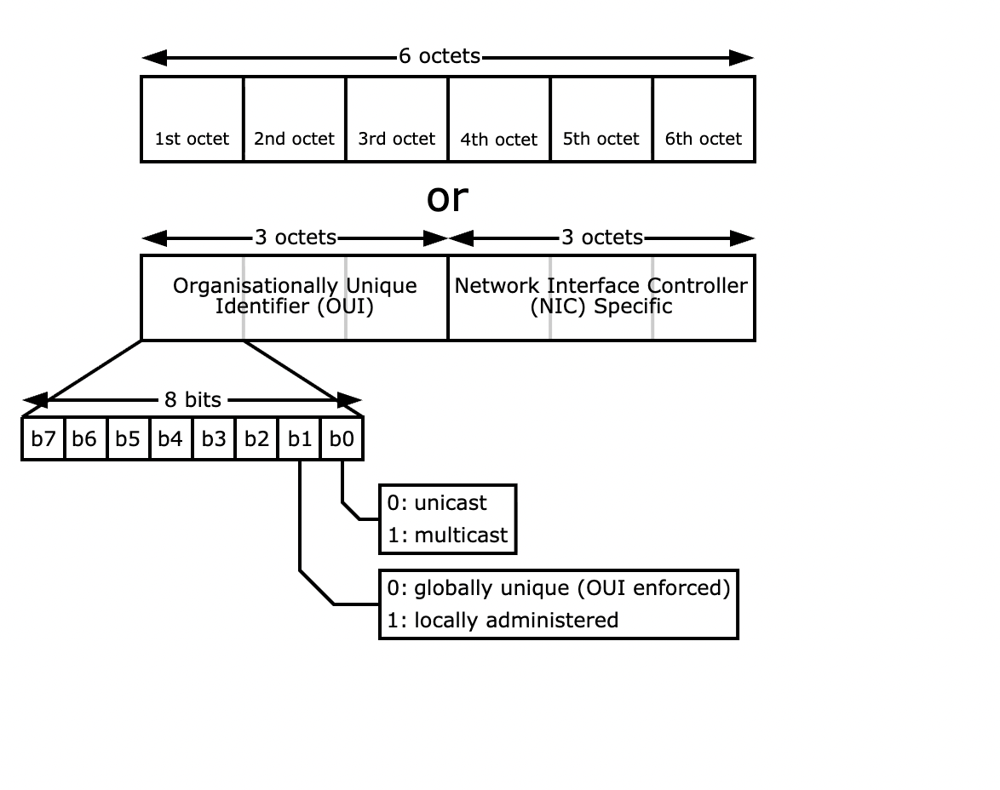

Physical and Hardware Isolation - How to change the Mac Address

https://technitium.com/tmac/

https://linuxconfig.org/change-mac-address-with-macchanger-linux-command

https://www.howtogeek.com/220462/how-to-find-and-change-your-mac-address-on-os-x/

https://macdaddyx.macupdate.com/

https://wifispoof.com/

Physical and hardware isolation involves separating devices, systems, or networks at the hardware level to enhance security and prevent unauthorized access or interference. This includes practices such as air-gapped systems, physically disconnected networks, dedicated servers for sensitive workloads, and hardware-based security modules (HSMs). By isolating devices physically, organizations reduce the risk of malware propagation, data exfiltration, or unauthorized remote access. Hardware isolation also includes controlling network interfaces, USB ports, and device drivers to prevent direct hardware-based attacks.

Changing the MAC Address

The MAC (Media Access Control) address is a unique identifier assigned to a network interface card (NIC). Changing it can support privacy, testing, or network segmentation by masking the original hardware identity. While changing the MAC address does not provide full anonymity, it can help prevent tracking on shared networks. Steps differ by operating system:

Windows:

Open Device Manager → Network adapters → Right-click NIC → Properties.

Go to the Advanced tab → Select Network Address / Locally Administered Address → Enable and input the new MAC.

Restart the network adapter.

Linux:

Use ifconfig or ip link commands:

sudo ifconfig eth0 down
sudo ifconfig eth0 hw ether XX:XX:XX:XX:XX:XX
sudo ifconfig eth0 up

Or with ip:

sudo ip link set dev eth0 down
sudo ip link set dev eth0 address XX:XX:XX:XX:XX:XX
sudo ip link set dev eth0 up

macOS:

Open Terminal:

sudo ifconfig en0 ether XX:XX:XX:XX:XX:XX

Restart the network interface.

Changing the MAC address is often combined with physical and hardware isolation strategies in high-security environments, helping prevent device tracking, enforce network policies, or test segmentation in controlled labs.