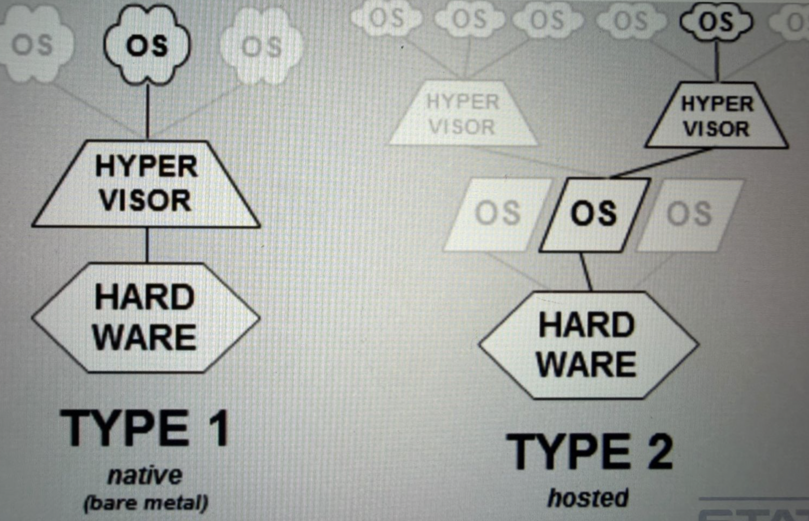

https://en.wikipedia.org/wiki/Hypervisor

https://en.wikipedia.org/wiki/Kernel-based_Virtual_Machine

https://virt-manager.org/

http://sianios.com/kvm-debian-jessie/

https://openvz.org/Main_Page

https://www.turnkeylinux.org/openvpn

https://en.wikipedia.org/wiki/Comparison_of_platform_virtualization_software

# Virtual Machines

A Virtual Machine (VM) is a software-based emulation of a physical computer that runs an operating system and applications in an isolated environment. VMs operate on top of a hypervisor, which can be either type 1 (bare-metal) or type 2 (hosted), to manage resources and ensure separation from the host system. Virtual machines provide strong isolation, allowing multiple OS instances to run on a single physical machine without interfering with each other. This makes VMs ideal for testing, development, and running potentially unsafe software securely. Benefits include improved security, system flexibility, resource consolidation, and the ability to create snapshots for easy recovery. Limitations include higher resource overhead compared to containers and potential performance impacts. Overall, virtual machines are a foundational technology for secure, isolated computing environments and are widely used in enterprise and cloud infrastructures.
