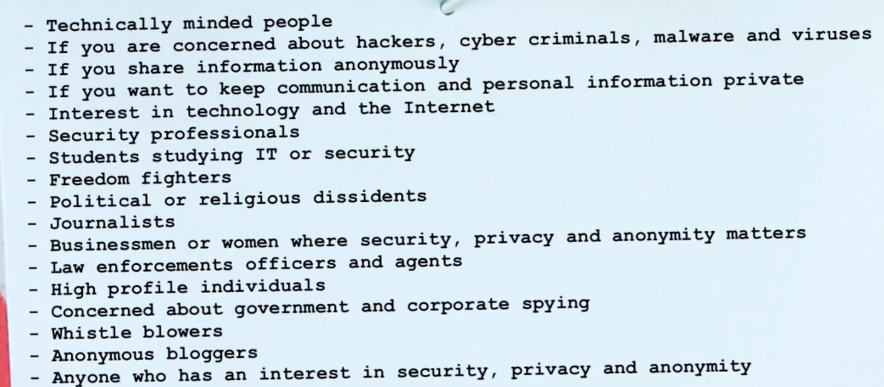

CanaryTokens - Very Important Hidden Security Traps

https://canarytokens.org/nest/

Canarytokens are like motion sensors for your networks, computers and clouds. You can put them in folders, on network devices and on your phones.

Place them where nobody should be poking around and get a clear alarm if they are accessed. They are designed to look juicy to attackers to increase the likelihood that they are opened (and they are completely free).

Goals and Learning Objectives for this course

1. Master the fundamental building blocks of security and privacy
2. Understand the online threat and vulnerability landscape
3. Perform threat modelling and risk assessments
4. Determine personal threats and adversaries
5. Build test environments in VirtualBox and VMware
6. Master encryption
7. Understand Windows, MacOS, Linux security and privacy features
8. Be able to mitigate social engineering attacks
9. Use isolation and compartmentalization effectively

Target Audience

1. Cybersecurity Analysts
2. Students in cybersecurity

Study Recommendations

Take notes!

Certificate - StationX - https://www.stationx.net/certificate-request/

Cyber security and Ethical Hacking Careers : 

1. Penetration Tester/Ethical Hacker: Simulates attacks to find weaknesses.
2. Information Security Analyst: Manages security tools, monitors threats, and suggests solutions.
3. Security Engineer: Designs, builds, and maintains security systems.
4. Vulnerability Assessor: Identifies, categorizes, and prioritizes system vulnerabilities.
5. Security Consultant: Advises organizations on security best practices.
6. Red Team Member: Specialized role in advanced adversarial simulations.
7. Malware Analyst: Studies malicious software.
8. Cyber Security Trainer/Educator

The cybersecurity unemployment rate was at 0% in 2019, where it has been for 8 years.
There is predicted to be 3.5 million unfilled cyber security jobs by 2021 up from 1 million position in 2014.

