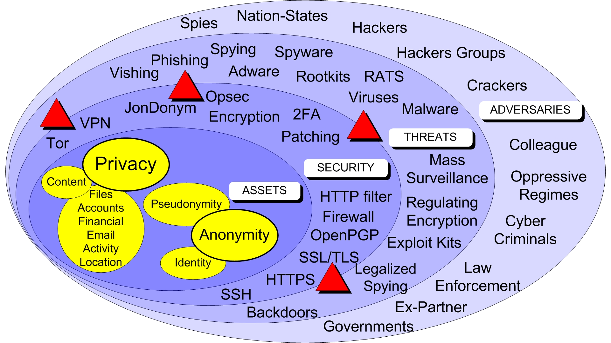

What is privacy, anonymity and Pseudonymity

Privacy is controlling who sees your data, Anonymity is hiding your identity completely, and Pseudonymity involves using a persistent alias (like a username) to mask your real self while still being identifiable as that alias, offering a middle ground between full disclosure and total anonymity for accountability

Security, Vulnerailities, Threats and Adversaries

Risk = Vulnerabilities X Threats X Consequences

Security is a technology
Security is an action
Security is a process

