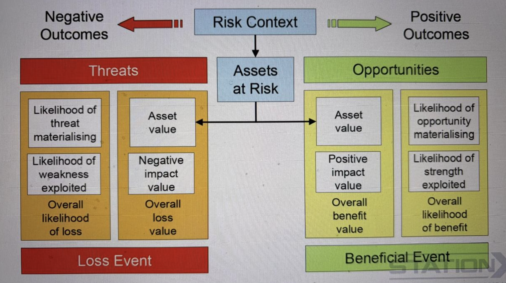

Risk Assessment Methods
1. https://www.stationx.net/sabsa
2. https://www.iso.org/standard/56742.html
3. https://www.securityforum.org/

Threat Modelling and Risk Assessments

Cannot have 100% Security
Cannot have 0 RISK

Unless you stop engaging in an activity

You need to take a risk based approach to applying the right level of security
to mitigate the risk without without it being overburdensome to the point,
where the system is unusable

You should do basic threat modelling and risk assessments
when selecting your security controls

1. Assets
2. Vulnerabilities
3. Threats
4. Adversaries
5. Consequences

1. Select 
2. Implement
3. Assess
4. Monitor

Security protects data from threats (locks the door), privacy controls who sees your data (you decide who gets a key), and anonymity hides who you are (no name on the mailbox), but achieving strong levels of all three simultaneously is a difficult balancing act, often requiring significant effort and specialized tools like VPNs and Tor, as they involve different levels of data control, access, and identity masking, with strong anonymity often needing robust underlying security and privacy measures
Interdependent but distinct: You need security to protect privacy, and you need privacy to have effective anonymity, but a secure system (like a bank) isn't private (it knows your transactions), and an anonymous action (like using Tor) can still be compromised by underlying security flaws.

