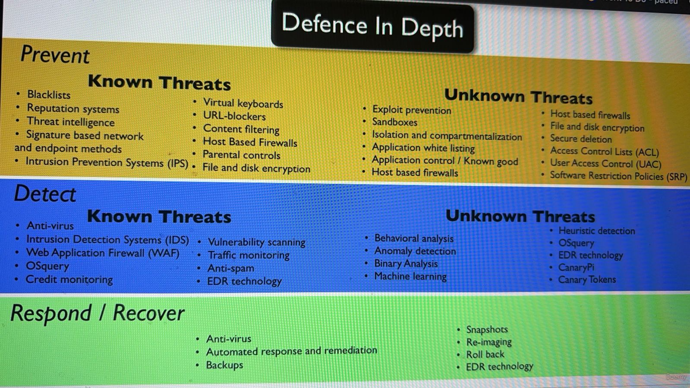

Defense in Depth

Prevent | Detect | Recover

The Zero Trust Model

The zero trust model is a cybersecurity strategy that operates on the principle of "never trust, always verify," meaning it requires strict identity verification for every person and device trying to access resources on a network, regardless of their location. Instead of assuming that everything inside the network perimeter is safe, this model assumes breaches occur and validates each access request. It uses a combination of security measures like multi-factor authentication, endpoint security, and analytics to enforce the principle of least privilege.

1. Evolving threat landscape: Traditional "castle and moat" security models are insufficient because modern workforces are mobile and data is often in the cloud, blurring the network perimeter. 
2. Increased attack surface: Remote workers, cloud services, and the use of personal devices increase the number of potential entry points for attackers. 
3. Protecting against insider threats: By not implicitly trusting anyone, the model can mitigate the risk of a compromised internal account being used to move freely within the network. 
4. Regulatory compliance: There is a growing push for government agencies and organizations to adopt zero trust architectures to improve security posture