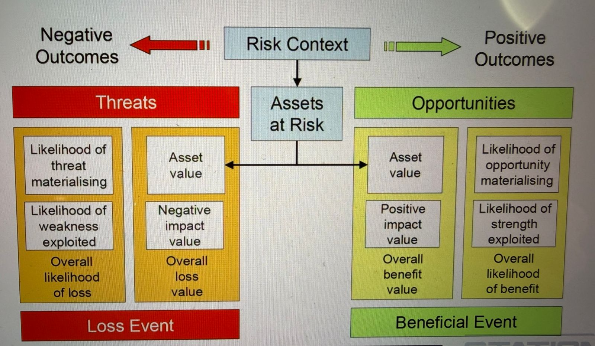

Steganography

Steganography is the practice of hiding secret information inside ordinary, non-sensitive media such as images, audio files, videos, text documents, or network protocols, in a way that conceals not just the content but the very existence of the hidden message. Unlike encryption—which protects data by making it unreadable but visibly scrambled—steganography embeds information so subtly that observers remain unaware anything is hidden at all. Common techniques include modifying the least significant bits (LSBs) of image pixels, embedding data in audio frequency ranges that humans cannot hear, or disguising messages within whitespace or metadata. Steganography is used for legitimate purposes such as watermarking, secure communication, and copyright protection, but it is also misused by threat actors to exfiltrate data, bypass detection systems, or coordinate covert operations. Because the hidden content blends into benign-looking files, steganography can evade traditional security tools that only check for abnormal behavior or encrypted traffic. Detecting steganography often requires specialized forensic analysis, known as steganalysis, which looks for inconsistencies in file structure, statistical anomalies, or unusual patterns. Overall, steganography is a powerful technique that illustrates how security can be compromised not only by breaking encryption but by concealing malicious intent within ordinary digital artifacts.

https://embeddedsw.net/doc/OpenPuff_Help_EN.pdf

https://www.jjtc.com/Steganography/tools.html

https://www.spammimic.com/

https://embeddedsw.net/OpenPuff_Steganography_Home.html

How Security and Encryption is Really Attacked

http://schneier.com/essays/archives/1998/01/security_pitfalls_in.html

Modern security systems and strong encryption algorithms are rarely broken by mathematically cracking the cryptography itself. Instead, attackers target the weak points around encryption—people, devices, configurations, and implementations. Many attacks focus on human error, such as phishing, social engineering, credential theft, or tricking users into installing malware that bypasses encryption entirely by capturing data before it is encrypted or after it is decrypted. Others exploit software vulnerabilities, misconfigured servers, outdated libraries, weak passwords, or insecure key storage, allowing attackers to steal or forge cryptographic keys rather than attacking the encryption algorithm. Side-channel attacks target timing, power usage, electromagnetic leaks, or memory access patterns to infer secrets without breaking the cipher. Network-level attacks, such as SSL stripping, DNS spoofing, or rogue Wi-Fi access points, downgrade or intercept encrypted connections. Even hardware flaws—like Spectre, Meltdown, or supply-chain tampering—can undermine the environment where encryption operates. In short, encryption is strong; it’s everything around it that’s weak. Real-world attacks succeed not by defeating the math, but by exploiting the human and technical systems that rely on it.

